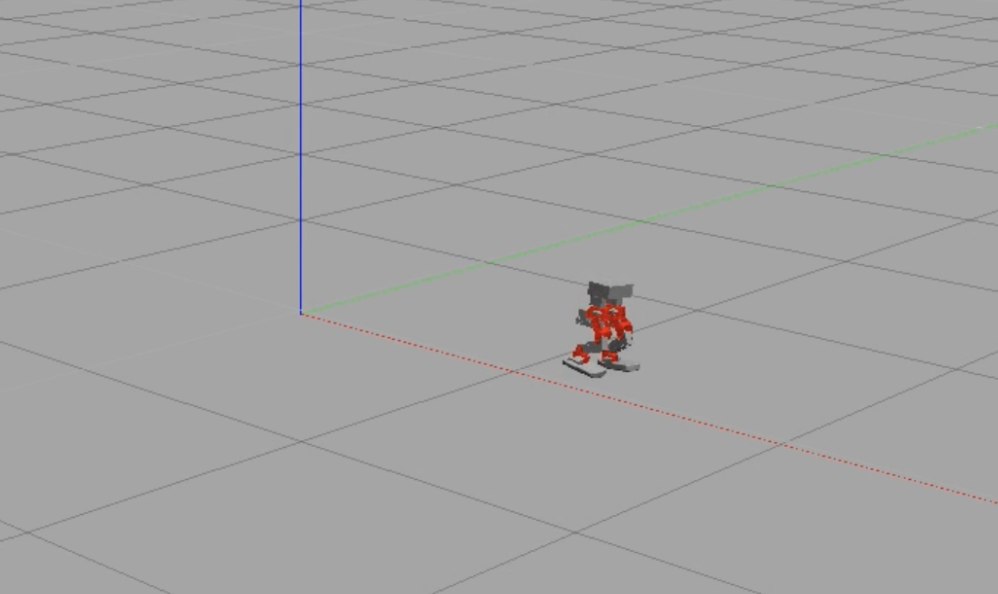
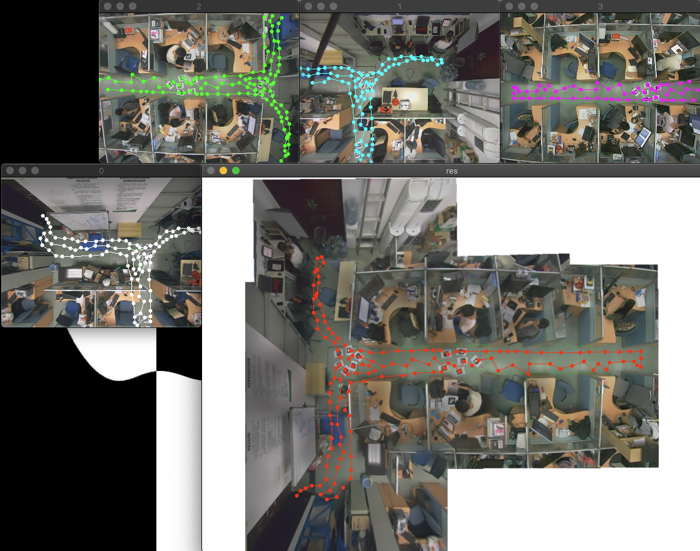
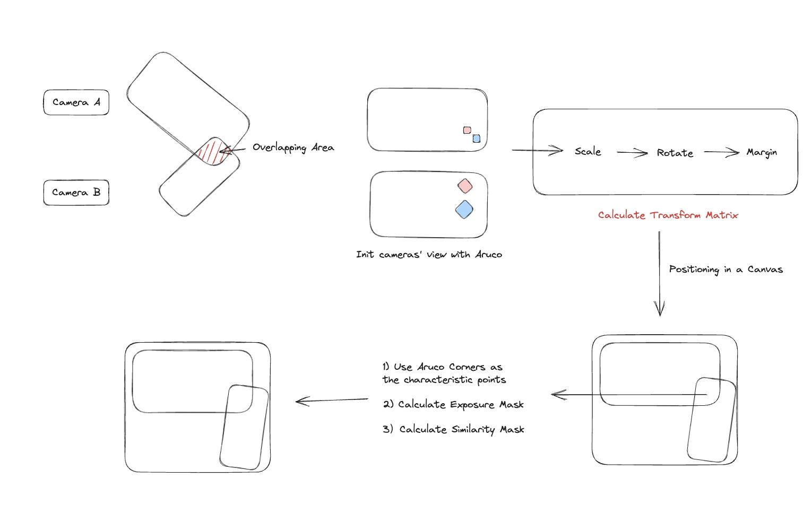
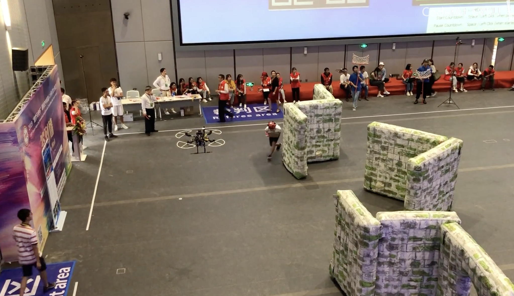
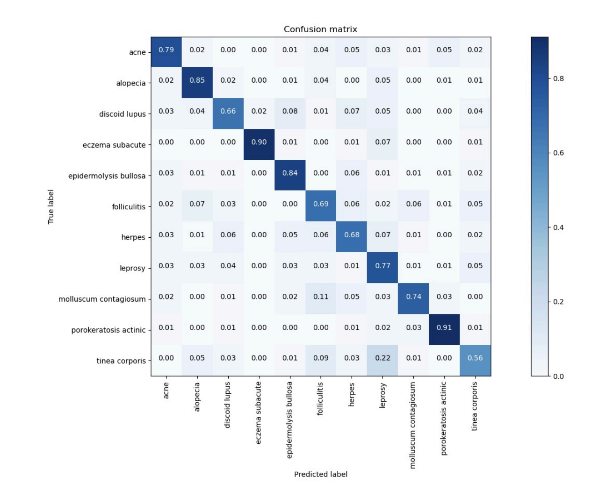
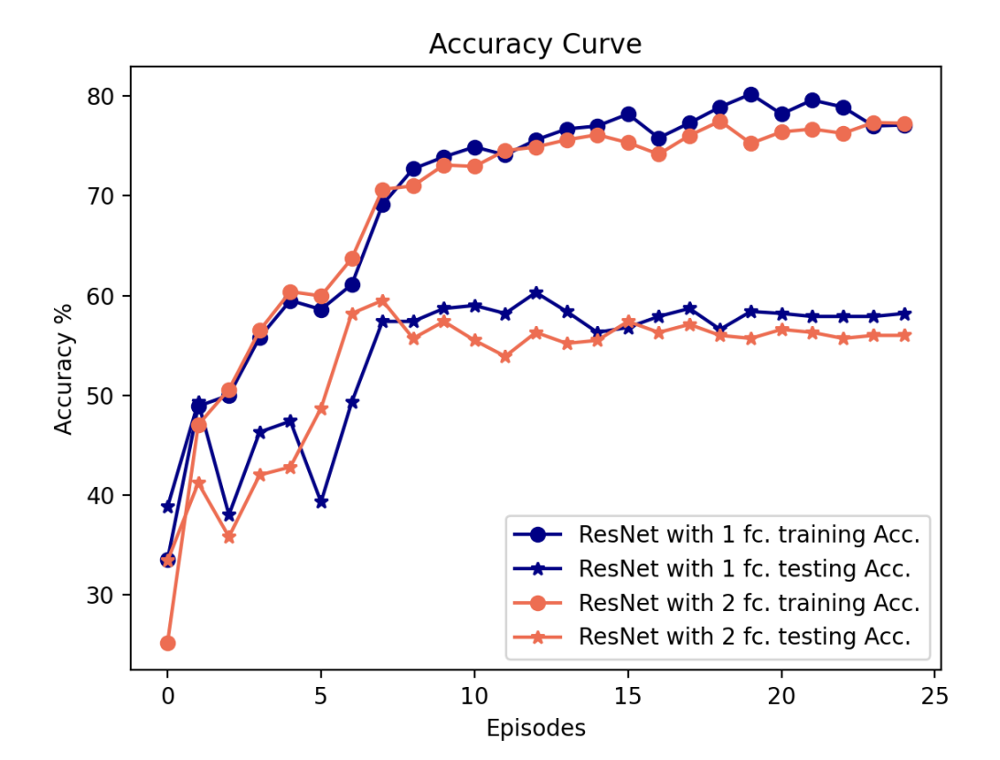
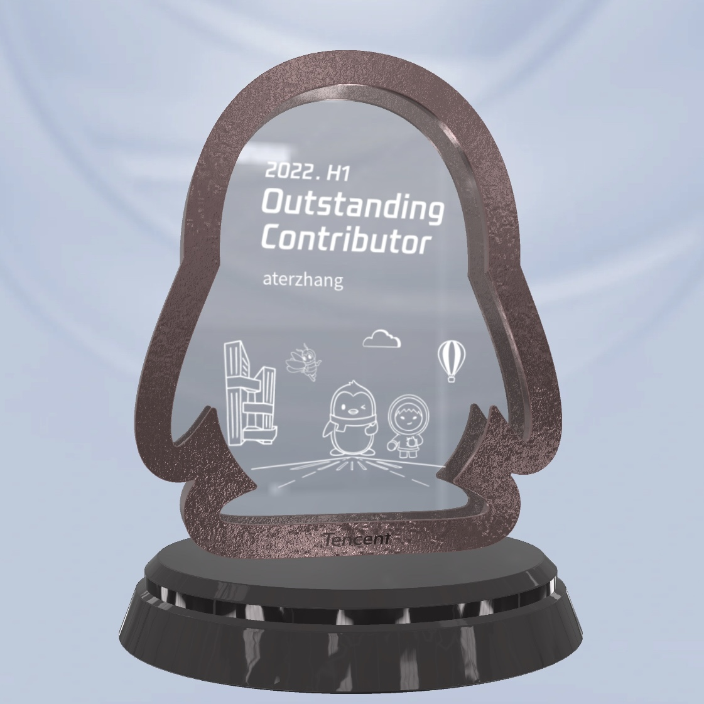
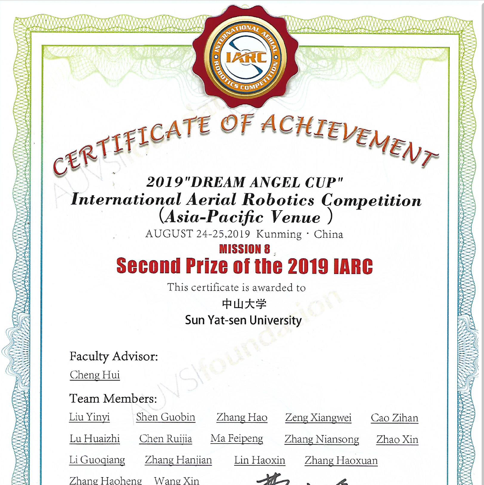
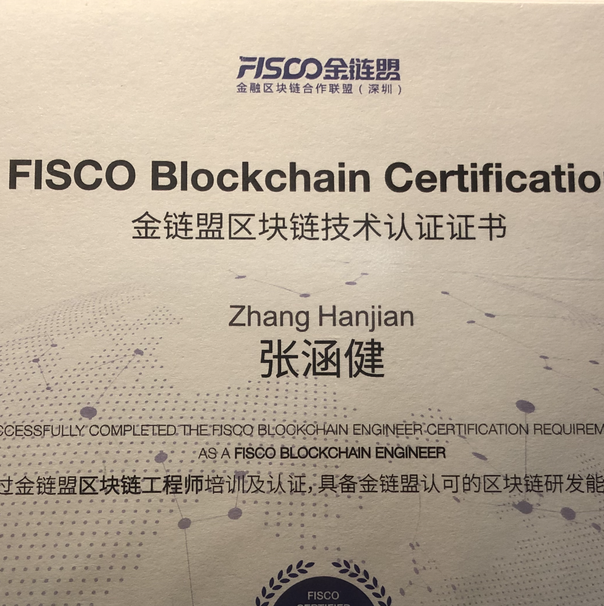

<h3 align="center"> aterzhang21@gmail.com </h3>

## EDUCATION

### Bachelor of Engineering, Sun Yat-sen University

Software Engineering, Guangzhou, China, 2017.9 – 2021.6

## PROFESSIONAL EXPERIENCE

### Tencent Technology (Shenzhen) Co. Ltd.

Junior Software Engineer, PCG, 2021.7 - Present

- Project manager of X5 mobile browser core and SDK, which serves for more than 500
million users in WeChat, Mobile QQ, JD.com, QQBrowser etc.
- Proposed and achieved an optimized DevOps CI/CD procedure and auxiliary software
tools, declining 60% labor costs to 1 people/day for each version iteration.
- Designed and achieved a framework of dynamic components for TBS business version,
including device authorization, dynamic distribution, version management and quality
analysis.
- Optimized Chromium initialization performance in Android, designed and replaced a new K-
V storage framework in X5, cutting down ANR rate in Mobile QQ for around 50% to
less than 0.005%
- Tencent Browseing Service Website: [x5.tencent.com](https://x5.tencent.com)

## RESEARCH EXPERIENCE

### Bipedal Robotics Reinforcement Learning Research

 

Team leader, Sun Yat-sen University, 2020.9 - 2021.1

- Mentor: [Liang Lin](https://scholar.google.com/citations?user=Nav8m8gAAAAJ&hl=zh-CN&oi=ao), Professor
- Research in bipedal robotics walking control method. Achieved an automatic solution for
bipedal robot walking control by reinforcement learning.
- In gym with PyTorch, used Walker2D to delve into factors of RL algorithm. Using SAC
algorithm, achieve precisely walking in complex 2D circumstance, and simply straight
walking in 3D circumstance.
- Tutorial: [https://github.com/CoderAT13/BipedalWalkerHardcore-SAC](https://github.com/CoderAT13/BipedalWalkerHardcore-SAC)
      
      

### View Fusion of Multiple Cameras based on OpenCV Aruco 

 

Team leader, Sun Yat-sen University, 2019.2-2020.1

- Mentor: Xiaohua Xie, Associate Professor
- A project of scientific research internship in the lab of Prof. Xiaohua Xie.
- Propose an image overlapping area positioning and fusion method for pedestrian trajectory tracking between multiple vertical cameras, based on OpenCV Aruco.
- The method is eventually integrated into the laboratory's camera products and applied to
wide-area passenger trajectory tracking.
- Project: [https://github.com/CoderAT13/Fusioner](https://github.com/CoderAT13/Fusioner)

### AUVSI Foundation International Aerial Robotics Competition 

Team member, Sun Yat-sen University, 2018.9-2019.7

- Mentor: Hui Cheng, Professor
- Mission 8 in IARC, target to achieve a drone system to recognize and decode divided QR codes in complex environment.
- Contributed to 1/4 QR code recognition system and image enhancement system, optimizing the performance of drones when shaking, low light, and blurry.
- Team won the second prize and was the first one to achieve the mission
- Cert: [link](学科/国际空中机器人大赛（亚太赛区）获奖证书.pdf) 
- Competion Websit: [link](http://www.aerialroboticscompetition.org/mission8.php)

### Skin Disease Image Classification And Its Application

 

First Author, Sun Yat-sen University, 2020.9-2021.5

- Graduation thesis and project. Mentor: Prof. Fan Zhou. Advisor: Guifeng Zheng
- Proposed a skin disease classification model based on migration learning deep convolutional neural network (single­ fully connected layer ResNet).
- The accuracy of the solution was better than other experimental networks and the image classification training tool CreateML developed by Apple, and it was converted to a Core ML model through PyTorch to achieve an offline machine learning application on the iOS mobile terminal.

## OTHER ACTIVITIES

- 2017-2018 Secretary of the Life Department of the Youth League Committee of the School of Data and Computer Science
- 2018-2019 Deputy minister of the Life Department of the Youth League Committee of the School of Data and Computer Science
- 2018.6 Volunteer of technical social service for countryside. (Qingyuan, Guangdong, China)
- 2022.3 Volunteer of COVID-19 anti-epidemic social service. (Shenzhen, Guangdong, China)

## PROFESSIONAL SKILLS

- Area: Computer Vision, Digital Image Processing, Android, iOS, Web, Browser Engine, Deep Learning, Reinforcement Learning
- Language: c/c++, java, python, golang, shell, javascript

## HONORS

### HONORS & AWARDS

1. 2017-2018 Sun Yat-sen University Outstanding Student Scholarship 
2. 2018-2019 Sun Yat-sen University Outstanding Student Scholarship 
3. 2019-2020 Sun Yat-sen University Outstanding Student Scholarship 
4. 2019 Provincial first prize in the National Mathematical Modeling Competition, China
5. 2019 International Aerial Robot Competition (IARC) Second Prize
6. FISCO Blockchain Technology Development Certification Certificate
7. 2022 H1 Tencent Outstanding Contributor

## PROJECTS

### Undergraduate

1. [A highly Robust Quarter QR Code Recognization and Image Enhancement System on a drone](学科/国际空中机器人大赛（亚太赛区）获奖证书.pdf) （Team Work）
2. Online Certifications Generation System for professional devices, based on SpringBoot and React（Independently）
3. [View Fusion of Multiple Cameras based on OpenCV Aruco](学科/Fusioner/README.md)（Owner）
4. [FISCO Block Chain Industrial Commerce System](https://github.com/CoderAT13/FISCO-FINAL)（Block Chain Course Work）（Owner）
7. [Magic Mat](https://www.bilibili.com/video/BV1Uk4y1C7PW/)（iOS Image Processing APP）（Owner）
8. [SYSU Helper](https://www.bilibili.com/video/BV1GK4y1s7Mu)（Android Feeds APP）（Owner）
9. [Bipedal Robotics Reinforcement Learning Research](https://github.com/CoderAT13/BipedalWalkerHardcore-SAC)（[report](https://github.com/CoderAT13/BipedalWalkerHardcore-SAC/blob/main/data/BipedalWalkerTest.md)）

### Professional

1. Web publishing solution with integrated front-end and back-end. Manager/Developer can just upload a jar file to accomplish a lite but functional complex front-end & back-end publishment.
2. Real time qualities monitor for a dynamic browser engine in hundreds of mobile apps.
3. Browser engine performance optimization.
4. AI assitance for developer service.
5. Business authentication and dynamic component delivery solution for paas in mobile.
